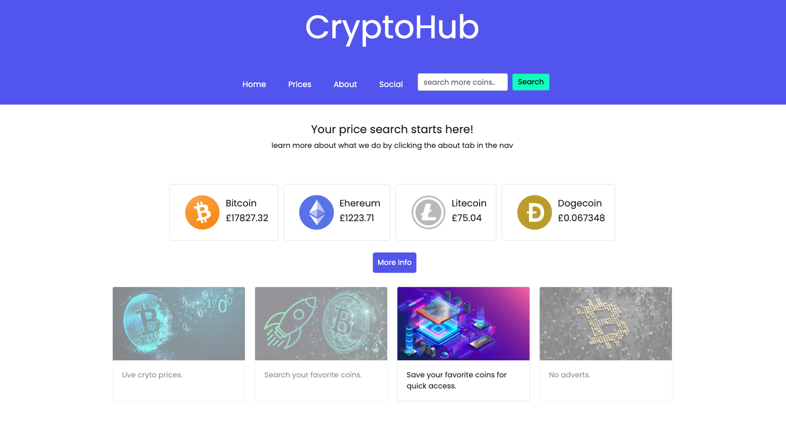
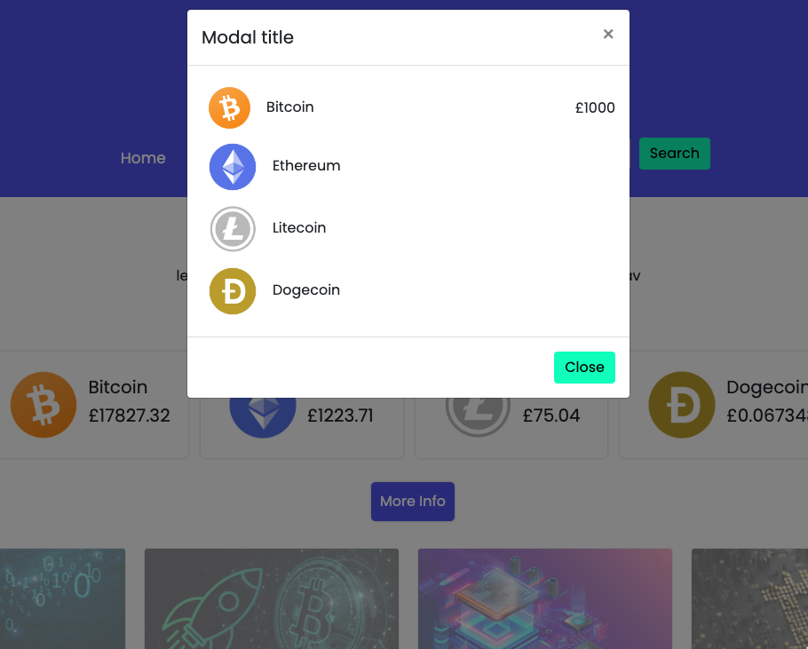

# Crypto App Template - Work in Progress

## The Task:

* Build a responsive web app template using some new skills that I have learnt over the last 8 weeks.

    * Use Bootstrap or some other CSS framework.
    * Be deployed to GitHub Pages.
    * Be interactive (i.e., accept and respond to user input).
    * Use server-side APIs.
    * Include Modals
    * Use client-side storage to store persistent data.
    * Be responsive.
    * Have a polished UI.
    * Have a clean repository that meets quality coding standards (file structure, naming conventions, follows best practices for class/id naming conventions, indentation, quality comments, etc.).
    * Have a quality README (with unique name, description, technologies used, screenshot, and link to deployed application).

## Technologies Used:

* We have used the following technologies to create our app:

    * CSS
    * Bootstrap
    * UIKit
    * JQuery
    * Javascript
    * Coingecko API: https://www.coingecko.com/en/api

## Installation

To run the application, simply open the following link in your chosen web browser.

Search for your favorite crpto coins to be displayed on the homepage.

Crypto app template: https://shaky411.github.io/Crypto-App/?

## Usage

Details to follow...

## Screenshots

## Credits

N/A

## License

MIT license
